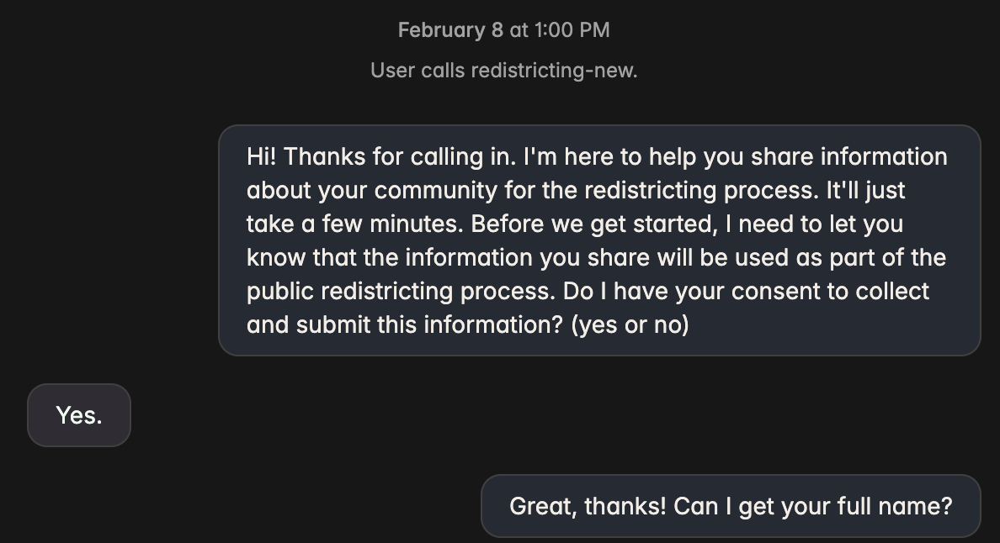

# Redistricting Voice Agent

Gathering data about how people define their community is a critical step in the redistricting process. In 2019, I cofounded the Representable.org project in partnership with Princeton's Electoral Innovation Lab. We had people draw their community on a map with MapBox and type in the info about their community.

Although this tool was used successfully in several states during the 2020 redistricting cycle, the fact that people had to have access to a laptop, a fast internet connection, and the willingness to create an account and hand-draw their community made it inaccessible to the broader public.

In 2026, realistic voice agents with tool calling have made it possible to collect community data from the public with only a phone call. For the next redistricting cycle, we want everyone to be able to contribute.

First, call the voice agent (active for a limited time at +1(385)492-6497):


Submissions are stored in Supabase and viewable on a Next.js dashboard (deployable to Vercel).

# How to use

## Prerequisites

1. Sign up for a Cartesia account at [Cartesia](https://cartesia.ai) and create a voice agent and link to Github in settings. Then, clone the repo for that agent locally.
2. Sign up for an Anthropic developer account and get an API key at [Anthropic](https://console.anthropic.com/api-keys).
3. Create a [Supabase](https://supabase.com) project and run the schema in `supabase_schema.sql` via the SQL Editor.

## Voice Agent Setup

1. Install the Cartesia CLI and `uv` to manage dependencies and virtual environments.

```bash
curl -fsSL https://cartesia.sh | sh
curl -LsSf https://astral.sh/uv/install.sh | sh
```

2. Create a [Cartesia API key](https://play.cartesia.ai/keys). You will need this in the next step.
3. Get a [Google Maps API key](https://console.cloud.google.com/apis/credentials) and enable the "Geocoding API".
4. Set up Supabase:
   - Create a new project at [supabase.com](https://supabase.com)
   - Go to the SQL Editor and run the contents of `supabase_schema.sql`
   - Copy your **Project URL** and **service_role key** from Settings → API
5. Authenticate into Cartesia and initialize a project. You can link this project to an agent you created.

```bash
cartesia auth login
cartesia init
```

6. Start your agent server.

```bash
uv sync
ANTHROPIC_API_KEY=your-anthropic-key GOOGLE_MAPS_API_KEY=your-google-maps-key SUPABASE_URL=https://your-project.supabase.co SUPABASE_SERVICE_KEY=your-service-role-key PORT=8000 uv run python main.py
```

7. In a separate terminal, chat with your agent by simply running:

```bash
cartesia chat 8000 # test your agent's reasoning in text
```

8. Commit your changes to `main` and `git push`. Cartesia will auto-deploy your `main` branch.

## Dashboard Setup (Next.js / Vercel)

1. Navigate to the `web/` directory and install dependencies:

```bash
cd web
npm install
```

2. Create a `.env.local` file (see `.env.local.example`):

```bash
NEXT_PUBLIC_SUPABASE_URL=https://your-project.supabase.co
NEXT_PUBLIC_SUPABASE_ANON_KEY=your-anon-key
```

3. Run the dashboard locally:

```bash
npm run dev
```

4. To deploy to Vercel:
   - Push your repo to GitHub
   - Import the project in [Vercel](https://vercel.com) and set the **Root Directory** to `web`
   - Add the `NEXT_PUBLIC_SUPABASE_URL` and `NEXT_PUBLIC_SUPABASE_ANON_KEY` environment variables
   - Deploy

## Testing

The project includes test scripts for validating the geocoding functionality:

```bash
# Set your API key
export GOOGLE_MAPS_API_KEY=your-key

# Run geocoding tests
uv run python tests/test_geocoding_simple.py
uv run python tests/test_full_flow.py

# Or run with inline key
GOOGLE_MAPS_API_KEY=your-key uv run python tests/test_full_flow.py
```

See `tests/README.md` for detailed testing information.

# Quick Reference

## Redistricting Basics
- **Main districts**: Congressional, State Senate, State House (redrawn every 10 years)
- **Goal**: Keep communities of interest together in single districts
- **Problem**: Gerrymandering splits communities for political advantage
- **Solution**: Collect community data to challenge unfair maps

## Agent Workflow
1. Collect caller name (optional) and zipcode
2. Get community name and description
3. Gather location data (key places, boundaries)
4. Document cultural, economic, and social interests
5. Capture other considerations for redistricting

## Data Storage
All submissions are stored in Supabase with:
- Form answers (community details, cultural/economic interests)
- Geocoded coordinates and landmarks (JSONB)
- GeoJSON polygon for boundary visualization (JSONB)
- Static map image URL (Google Static Maps)

## Dashboard
The `web/` directory contains a Next.js app deployable to Vercel with:
- **Table view**: Browse all submissions with caller, community, location, and date
- **Map view**: Interactive Leaflet map showing community polygons and markers
- **Detail panel**: Click any submission to see full community details

## Future Integration
- **District lookup**: Show current districts by zipcode
